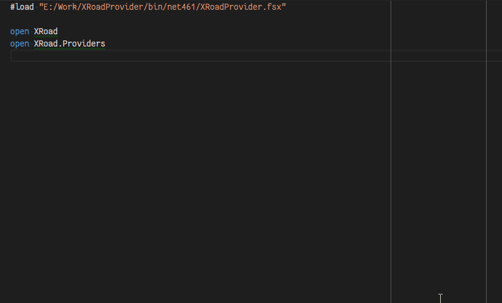

# XRoadProducer Type Provider #

`XRoadProducer` is the main working horse of the package. It takes X-Road web service WSDL
specification as input and returns a type which wraps all the types defined in the `types`
part of WSDL document and also service client types which implement `binding` part of
the WSDL document to provide service types for calling X-Road services over the network.

Although it looks like very dynamic code in IDE with all the code completion based on
WSDL definition, in the background the code is actually compiled into real assembly
which works as usual in .NET platform. So there is no runtime performance hit in
regards to resulting output of the type provider.


## XRoadProducer Type Provider in Action ##

Here is a small animation visualizing type provider usage in code editor or IDE with
proper F# language support (Visual Studio, Visual Studio Code with Ionide extension,
etc.).




## Configuring XRoadProducer ##

Primary functionality of `XRoadProducer` type provider is executed with the following line:

```fsharp
type Xrd6 = XRoadProducer<"E:/Work/XRoadProvider/tests/XRoadProvider.Tests/Wsdl/XRoadV6.wsdl.xml">
```

This line executes `XRoadProducer` type provider which interprets given service description document
(WSDL) and returns new type which wraps required types from the schema which enable communication
with web service that follows the same WSDL. The resulting root type is saved into current namespace
with given alias (`Xrd6` in current sample fragment).

The type provider takes its parameters between angle brackets `'<'` and `'>'` and for `XRoadProducer`
type provider there are following configuration options available:

| Parameter name | Type | Required | Default value | Description |
|----------------|------|----------|---------------|-------------|
| `Uri` | `String` | Yes | - | WSDL document location (either local file or network resource). |
| `LanguageCode` | `String` | No | `"et"` | Specify language code that is extracted as documentation tooltips. |
| `Filter` | `String` | No | `""` | Comma separated list of operations which should be included in definitions. By default, all operations are included. |

It should be noted, that type provider parameters can only be compile time constant values and literals
which means you cannot "calculate" the parameters. You can hold parameter values in literal values
using `LiteralAttribute` attribute:

```fsharp
let [<Literal>] WsdlLocation = "http://someurl/and.wsdl"
```

For local files, it is sometimes convenient to provide relative locations, which can be achieved by using
special F# compiler predefined variable `__SOURCE_DIRECTORY__` which represents path of the directory
containing current script or source file:

```fsharp
let [<Literal>] WsdlLocation = __SOURCE_DIRECTORY__ + "/file.wsdl"
```

Using predefined values as type provider arguments:

```fsharp
type Xrd6 = XRoadProducer<WsdlLocation>
```


## Structure of Returned Types ##

The `XRoadProducer` type provider generates one root type which holds all needed types
by the WSDL definition. The types are divided into two categories with their own
subtypes under the root type:

1. `DefinedTypes` holds types from WSDL `types` section grouped by the namespace
   they are defined in. These types are usually parameters of the services and types
   referenced by other types defined by Xml Schema standard. Each namespace type holds
   special `__TargetNamespace__` value which is literal value of the containing namespace.

2. Root type defines subtype for every `service` definition in WSDL document which
   themselves have subtypes for every `portType` binding that service definition.
   The `portType` binding type implements [AbstractEndpointDeclaration](xref:XRoad.AbstractEndpointDeclaration)
   which enables basic communication, that is described for that binding and also
   provides methods for each individual operation that is available for that binding.

   Each type extending [AbstractEndpointDeclaration](xref:XRoad.AbstractEndpointDeclaration)
   inherits configuration options for providing target service or security server
   url which serves X-Road requests; certificate parameters for trusting self-signed
   service certificates or providing client authentication certificates; and
   request/response event handlers to support message logging or for further message
   analysis.


## Third Party Dependencies ##

To expose better structure of WSDL definitions, the type provider library introduces
some dependencies to outcoming types:

* [Optional](https://www.nuget.org/packages/Optional/)
  Single value elements which have `minOccurs="0"` attribute defined in their definition
  are wrapped into `Option` type which expresses whether the value was provided in
  Xml message or not. `Option.Some<T>(...)` value specifies that Xml message contained
  the value which is wrapped into `Option` type. `Option.None<T>()` value represents
  missing Xml tag.

  When service description relies heavily on optional elements, the resulting types
  will contain a lot of optional properties, which makes their usage somewhat bloated.
  It is recommended to collect most of repeating logic into extension methods to
  simplify usage of optional values.

* [NodaTime](https://www.nuget.org/packages/NodaTime/)
  Since .NET framework default date/time type `System.DateTime` does not differentiate
  between date and dateTime types, the type provider package uses `NodaTime` package
  to represent date/time related types. Conversion options between NodaTime and System
  `DateTime` types can be studied from `NodaTime` documentation.
