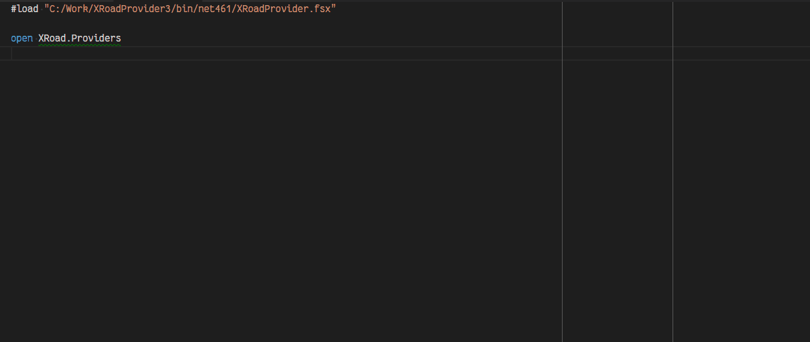

# XRoadServer6 Type Provider #

`XRoadServer6` type provider implements supporting functionality for easier X-Road
service discovery and exploration on X-Road v6 security server. There is also
similar type provider for previous version of X-Road security server, but with
adaption of newer security server, the older one is becoming obsolete so that
branch is not first maintainment priority. This article continues with newer
type provider.


## XRoadServer6 Type Provider in Action ##

Sample session of using XRoadServer6 type provider for service discovery:




## Configuring XRoadServer6 Type Provider ##

Generally `XRoadServer6` type provider is initialized with following line:

```fsharp
type Browse = XRoadServer6<"http://server-uri", "ee-dev", "GOV", "71111111", "generic-consumer">
```

The parameters used in initialization of the type provider are described in the
following table:

| Parameter name | Type | Required | Default value | Description |
|----------------|------|----------|---------------|-------------|
| `SecurityServerUri` | `String` | Yes | - | X-Road security server uri which is used to connect to that X-Road instance. |
| `XRoadInstance` | `String` | Yes | - | Code identifying the instance of X-Road system. |
| `MemberClass` | `String` | Yes | - | Member class that is used in client identifier in X-Road request. |
| `MemberCode` | `String` | Yes | - | Member code that is used in client identifier in X-Road requests. |
| `SubsystemCode` | `String` | No | `""` | Subsystem code that is used in client identifier in X-Road requests. |
| `ForceRefresh` | `Boolean` | No | `false` | When `true`, forces type provider to refresh data from security server. |

The first five parameters handle identification, so and are required by security
server to enable usage of metaservices on which the type provider relies.

Last parameter is of technical kind and for lazy users who do not want to restart
their IDE for WSDL reloading (by default resulting types are cached and retrieved
from cache, but this parameter forces type provider to resolve service description
again even if there is a cached version available).


## Returned Type Structure ##


## Interaction with XRoadProducer Type Provider ##

